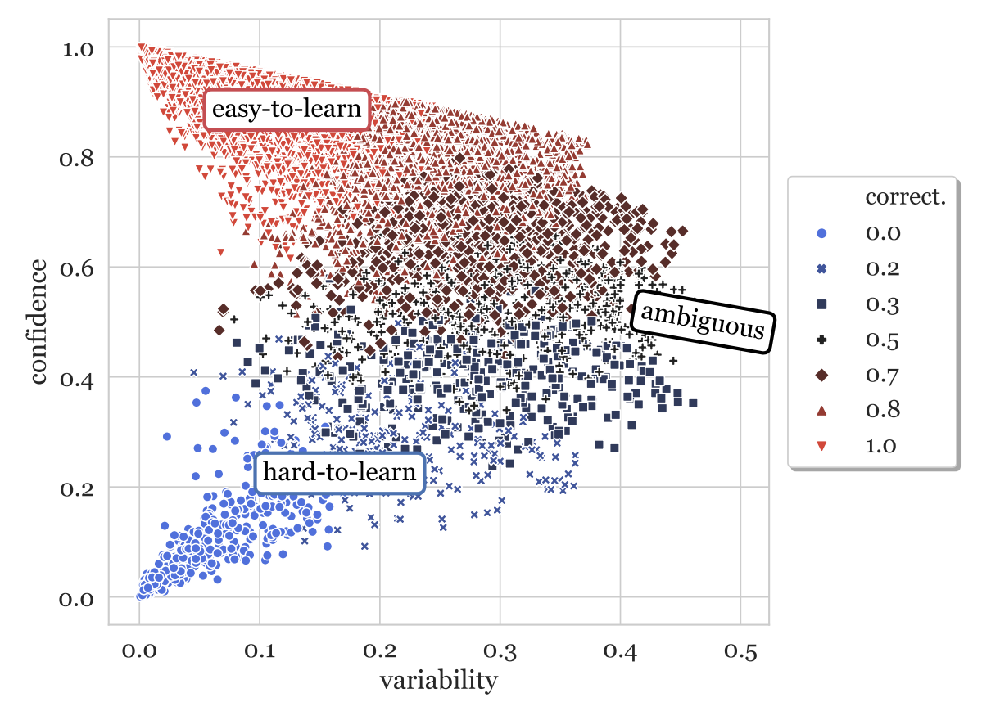

# Tiny Data Maps
 A minimal implementation of Data Maps for the Huggingface libraries from the 
 ["Dataset Cartography: Mapping  and  Diagnosing Datasets  with  Training Dynamics"](https://arxiv.org/abs/2009.10795) paper.

## In a Nutshell 
This project contains callbacks that watch training dynamics 
(i.e. how well each gold label could be predicted after each epoch).  
This allows the creation of dataset maps as the one below that helps to 
find out which samples of a dataset are easier and which are harder to learn.  
An example on how to use it is given in the main.py file

## Sources
A more complete version can be found [here](https://github.com/allenai/cartography)
and a very good implementation as a tensorflow callback that served as template 
for this project can be found [here](https://github.com/eliorc/tavolo) under `learning.DataMapCallback`
